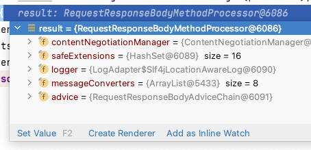

小伙伴在springboot中，使用fastjson解析response body，遇到了解析字段没有生效的情况。
例如：
```json
{"BBOSSOrderSource":1}
```
在controller中，实际获取到该字段为0。

于是决定动手试试，看看问题在哪里🤔。

### 复现问题场景
最初参考 [http://www.mydlq.club/article/83/](http://www.mydlq.club/article/83/) 配之后，发现确实存在上面问题。

### Debug+搜索🔍
于是单步调试，发现对请求体参数的解析是由RequestResponseBodyMethodProcessor处理的。于是google下看看有没有现成的讲解。相关的链接见Ref1和Ref2，均是基于扩展HandlerMethodArgumentResolver来实现，而且新增加了注解。

### Debug+观察👀
Spring框架不应该有这么笨的办法。继续观察RequestResponseBodyMethodProcessor中的字段，重点是messageConverters（默认是7个），里面没有fastjson的FastJsonHttpMessageConverter。


### 寻找配置方式
于是继续搜索SpringBoot的配置方式。最后使用官方提供的[Spring中集成Fastjson](https://github.com/alibaba/fastjson/wiki/%E5%9C%A8-Spring-%E4%B8%AD%E9%9B%86%E6%88%90-Fastjson) 方法。

### 优化
但是官方提供的方法有个小问题，configureMessageConverters方法，是覆盖了所有的MessageConverters，导致RequestResponseBodyMethodProcessor中的messageConverters中只有一个converter。但是又想保留所有默认的converter配置。

仔细看下WebMvcConfigurerAdapter中的JavaDoc，发现extendMessageConverters才是需要的。将方法名改为extendMessageConverters，终于可以解析Responsebody中的json成功了！😄

### Next
WebMvcConfigurerAdapter已经是Deprecated了，尝试下还有没有其他的配置方法。

Reference：
1. https://developer.aliyun.com/article/232631
2. https://programmerall.com/article/58371102132/